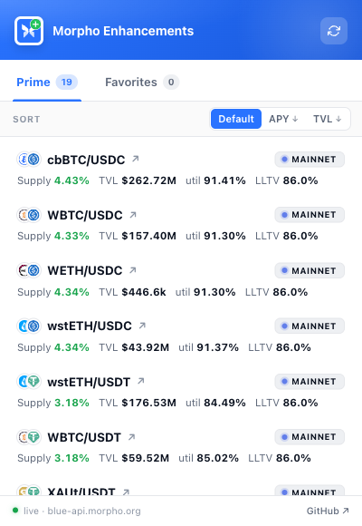
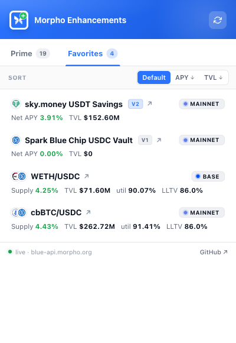
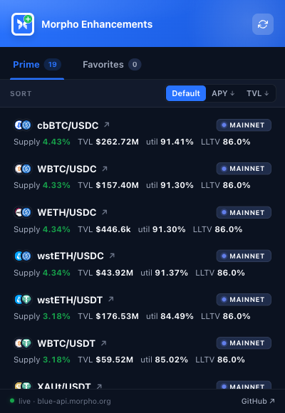
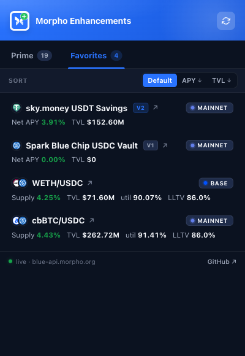

# Morpho Enhancements

[English](README.md) · [简体中文](README.zh-CN.md) · [日本語](README.ja.md) · **한국어** · [Русский](README.ru.md) · [Español](README.es.md)

[app.morpho.org](https://app.morpho.org) 의 네 가지 빈자리를 채우는 Chrome 확장입니다:

1. **마켓 단위 Supply / Withdraw** — Morpho Blue 마켓 페이지의 공식 UI 는 Borrow 만 제공합니다. 본 확장은 Borrow 옆에 **Lend** 탭을 주입해, 대출 자산을 해당 마켓에 바로 예치합니다(MetaMorpho vault 내부와 동일한 `Morpho.supply()` 호출). 같은 UI 에서 나중에 인출할 수도 있어, vault 를 거치지 않고 마켓 고유의 예치 이자를 받을 수 있습니다.

2. **대시보드 가시성** — 공식 대시보드는 vault 예치와 차입 포지션만 표시하며 직접 예치는 보여주지 않습니다. 본 확장은 **Market Lending** 카드를 추가해, Morpho 지원 전 체인에서의 직접 예치를 USD 금액·APY·마켓 바로가기와 함께 표시합니다.

3. **`/markets` 와 `/vaults` 즐겨찾기** — 행 앞의 별로 아무 마켓/vault 나 북마크한 뒤, 좌측 하단의 **Favorites only** 칩으로 관심있는 몇 개만 남깁니다. 브라우저에 저장되고 탭 간 동기화됩니다.

4. **툴바 popup 빠른 보기** — 확장 아이콘 클릭만으로: *Prime* 탭은 Mainnet / Base / Arbitrum / OP 의 엄선된 19 개 블루칩 마켓을 supply APY、TVL、이용률、LLTV 와 함께 표시. *Favorites* 탭은 즐겨찾기한 마켓과 vault(V1 / V2 MetaMorpho 모두 지원). APY 또는 TVL 로 정렬 가능, 행 클릭으로 app.morpho.org 의 해당 페이지로 이동.

<p align="center">
  
  
</p>

<p align="center">
  
</p>

<p align="center">
  
</p>

<p align="center">
  
</p>

<p align="center">
  
</p>

<p align="center">
  
  
</p>

<p align="center">
  
  
</p>

> 스크린샷은 모의 포지션 데이터를 사용합니다. 공개 이미지에는 실제 잔액, 주소, 마켓 해시가 포함되지 않습니다.

## 기능

- **Borrow | Lend 탭** — 마켓 패널에 Lend 탭이 추가됩니다. 라이트/다크 모두에서 Morpho 시각 언어에 맞춘 Supply / Withdraw UI 로 전환됩니다.
- **ETH / WETH 자동 래핑** — 대출 자산이 해당 체인의 wrapped-native 토큰일 때, 네이티브 통화(Polygon 의 POL, Monad 의 MON, HyperEVM 의 HYPE 등)로 결제할 수 있는 토글이 나타납니다. Supply 전 자동 wrap, Withdraw 후 자동 unwrap — 서명은 총 2 회, 별도 wrap 화면 이동 없음.
- **멀티체인 대시보드** — Market Lending 카드는 Morpho 가 지원하는 모든 체인을 한 번의 요청으로 조회합니다. 실제 체인 목록은 [src/services/chain/morphoSupportedChains.ts](src/services/chain/morphoSupportedChains.ts) 에 관리됩니다.
- **리스트 페이지 즐겨찾기** — `/markets` 와 `/vaults` 의 마켓/vault 에 별 표시를 하고, 원클릭 칩으로 내 선택만 남도록 필터. `chrome.storage.local` 만 사용(서버·추적 없음), `chrome.storage.onChanged` 로 탭 간 및 popup 과 동기화.
- **툴바 popup 두 탭** — *Prime*(Mainnet / Base / Arbitrum / OP 의 엄선된 19 개 블루칩 마켓) + *Favorites*(즐겨찾기한 마켓과 vault, V1 / V2 MetaMorpho 모두 지원, 행 안에 `V1`/`V2` 작은 칩). Stale-while-revalidate 캐시: 5 분 메모리 + `chrome.storage.local` 영속화로, popup 을 다시 열어도 첫 프레임에 마지막 데이터가 보이고 백그라운드에서 새로 가져옵니다. APY ↓ 또는 TVL ↓ 정렬 가능.
- **페이지 지갑 재사용** — 두 번째 connect 흐름 없음. MetaMask, Rabby, Frame, Coinbase Wallet, EIP-6963 호환 주입 지갑 모두 지원.
- **비표준 ERC-20 지원** — USDT(및 `approve` 가 데이터를 반환하지 않는 기타 토큰)가 그대로 동작합니다. approve ABI 를 no outputs 로 선언하여 viem 의 simulation 이 `0x` 에서 실패하지 않습니다.
- **사람이 읽을 수 있는 에러** — 서명 거부는 조용히 idle 로 복귀. 잔액 부족, 잘못된 체인, nonce 막힘, revert 사유는 2KB viem 덤프가 아닌 짧은 문장으로 표시됩니다.
- **분석·텔레메트리·백엔드 없음** — public RPC 로 Morpho Blue 컨트랙트 직접 호출, APY / USD 수치만 Morpho 공식 blue-api 로 가져옵니다.

## 동작 방식

- **컨트랙트** — 모든 읽기/쓰기는 Morpho Blue 싱글톤 `0xBBBBBbbBBb9cC5e90e3b3Af64bdAF62C37EEFFCb` (지원 체인 전체에서 CREATE2 로 동일 주소) 를 통해 이뤄집니다. `idToMarketParams(id)` 로 URL 의 market id 를 온체인 파라미터로 해석하고, `supply(params, assets, 0, onBehalf, "0x")` 로 예치, `position(id, user)` + `market(id)` 로 잔액 계산.
- **지갑 브리지** — `world: "MAIN"` content script 가 EIP-6963 discovery (+ 기존 `window.ethereum` 폴백) 를 구현하고, EIP-1193 요청을 `window.postMessage` 로 isolated content script 에 프록시합니다. UI 는 그 위에 viem `WalletClient` 를 올리며 키를 보유하지 않습니다.
- **데이터** — `https://blue-api.morpho.org/graphql` 에 대한 경량 GraphQL 로 APY 와 USD 를 조회. Shares-to-assets 계산은 직접 온체인 read 를 위해 `sharesMath.ts` 에도 로컬 포팅되어 있습니다.
- **UI** — React 19 이 Shadow DOM 안에 마운트되어 확장 스타일이 Morpho 페이지로 새지 않고 그 반대도 마찬가지입니다. SPA 전환은 `history.pushState` / `replaceState` 패치와, 애니메이션 기반 변동을 무시하는 스로틀된 `MutationObserver` 로 포착합니다.

## 지원 체인

| slug (URL) | chainId | native / wrapped-native |
|---|---|---|
| `ethereum` | 1 | ETH / WETH |
| `base` | 8453 | ETH / WETH |
| `arbitrum` | 42161 | ETH / WETH |
| `opmainnet` | 10 | ETH / WETH |
| `polygon` | 137 | POL / WPOL |
| `unichain` | 130 | ETH / WETH |
| `monad` | 143 | MON / WMON |
| `world-chain` | 480 | ETH / WETH |
| `katana` | 747474 | ETH / WETH |
| `hyperevm` | 999 | HYPE / WHYPE |

Slug 은 `app.morpho.org/sitemap.xml`, 주소는 [`morpho-blue-api-metadata`](https://github.com/morpho-org/morpho-blue-api-metadata) 에서 가져왔습니다.

## 설치

### GitHub Releases 에서 설치 (Chrome Web Store 심사 대기 중 권장)

`v*` 태그를 push 하면 GitHub Actions 가 빌드하여 ZIP 을 [Releases 페이지](../../releases) 에 첨부합니다. 설치 방법:

1. 최신 release 에서 `morpho-enhancements-<version>-unpacked.zip` 다운로드
2. 안정적인 위치(예: `~/extensions/morpho-enhancements/`) 에 압축 해제
3. `chrome://extensions` 열기
4. 우상단 **개발자 모드** 켜기
5. **압축해제된 확장 프로그램을 로드합니다** → 해제한 폴더 선택

Chrome 이 "개발자 모드 확장 프로그램" 경고를 표시합니다 — 로컬 설치 확장에서 항상 나타나는 정상 동작입니다. Chrome Web Store 심사가 통과되면 원클릭 설치가 가능하지만 며칠이 걸립니다; 기능적으로는 이 경로와 동일합니다.

### 소스에서 (개발)

```bash
pnpm install
pnpm build
# Chrome → chrome://extensions → 개발자 모드 → 압축해제된 확장 프로그램 로드 → ./dist 선택
```

개발은 `pnpm dev` (Vite + crxjs HMR) 로 반복 실행.

## 테스트

```bash
# 실제 사이트에 대한 DOM 프로브 (앵커와 샘플 레이아웃 JSON 캡처)
pnpm probe

# End-to-end — 빌드된 확장으로 Chromium 구동. Lend 탭, 대시보드 마운트,
# 다크 모드 가독성, provider bridge, 즐겨찾기 별 + 필터, 그리고 툴바 popup
# (탭, 정렬, V1/V2 vault 렌더링, chrome.storage 캐시) 검증
pnpm test:e2e
```

README 스크린샷 재생성 (GraphQL 응답은 mock 되어 실제 잔액이 노출되지 않음):

```bash
pnpm exec playwright test tests/e2e/screenshots.spec.ts
```

## 프로젝트 구조

```
src/
├── manifest.config.ts        # MV3 manifest 선언
├── content/
│   ├── main.ts               # ISOLATED world — SPA 라우트 감시 + 마운트 디스패처
│   ├── mount.ts              # Shadow DOM 호스트 + React root + 테마 동기화
│   ├── router.ts             # pushState/replaceState → locationchange 이벤트
│   ├── marketIntegration.ts  # 마켓 패널에 Borrow | Lend 탭 주입
│   └── listsIntegration.ts   # /markets 와 /vaults 의 즐겨찾기 별 + filter chip
├── lib/
│   ├── morpho.ts             # viem public client + Morpho 컨트랙트 헬퍼
│   ├── morphoAbi.ts          # IMorpho + ERC20 + WETH9 ABI
│   ├── sharesMath.ts         # SharesMathLib 포팅 (virtual shares/assets)
│   ├── chains.ts             # Slug ↔ chain ID, wrapped-native, RPC 폴백 목록
│   ├── url.ts                # 라우트 매처 (market / dashboard / list / other)
│   ├── favorites.ts          # chrome.storage.local 기반 즐겨찾기 + 탭 간 동기화 + E2E 브리지
│   ├── graphql.ts            # blue-api 클라이언트(마켓, V1/V2 vault, 배치 + SWR 캐시)
│   └── pageProvider.ts       # 브리지 클라이언트 + viem WalletClient 어댑터
├── ui/
│   ├── MarketLendForm.tsx    # 마켓 페이지 Supply / Withdraw 폼 (wrap 토글 포함)
│   ├── DashboardSupplyCard.tsx
│   ├── errorMessage.ts       # viem 에러 → 짧고 친절한 메시지
│   ├── format.ts             # bigint / USD / percent 포매터
│   └── styles.css            # Shadow-DOM 스코프 테마 토큰
├── popup/
│   ├── index.html            # MV3 툴바 popup 진입점
│   ├── main.tsx              # React root
│   ├── Popup.tsx             # 탭(Prime / Favorites), 정렬 바, 행 렌더링, 새로고침
│   ├── TokenIcon.tsx         # 토큰 아이콘 로더 (Morpho CDN → 글자 fallback)
│   └── popup.css             # 브랜드 banner, 탭, 행, 라이트 + 다크
├── data/
│   └── curatedMarkets.ts     # Prime 엄선 목록 (19 개 마켓, 수동 관리)
public/
├── icons/                    # scripts/make-logo.py 로 생성 (16/32/48/128)
├── logo.svg                  # 마스터 벡터 (Morpho 나비 + enhancement 배지)
└── injected/
    └── provider-bridge.js    # 앱 코드와 번들되지 않는 MAIN-world 순수 JS 브리지
scripts/
├── make-logo.py              # morpho-base.svg 에서 확장 아이콘 재생성
└── morpho-base.svg           # 공식 Morpho 나비 (소스)
tests/
├── probe/                    # app.morpho.org DOM 스크레이프
└── e2e/
    ├── extension.spec.ts     # Lend 탭, 대시보드 마운트, 다크 모드, provider bridge
    ├── favorites.spec.ts     # 별 + 필터 + 영속화 (postMessage 테스트 브리지 사용)
    ├── popup.spec.ts         # 툴바 popup — 탭, 정렬, V1/V2 vault, 캐시, 새로고침
    └── screenshots.spec.ts   # README / 스토어 스크린샷 (mock 데이터)
```

## 보안

- 컨트랙트 상태는 public RPC 로 읽습니다 (viem 가 체인별 4 개 provider 폴백). 쓰기는 사용자 지갑을 거치며, 확장은 개인키를 보유하거나 요청하지 않습니다.
- 모든 쓰기는 `writeContract` 이전에 `simulateContract` 로 선행 시뮬레이션하여, revert 가 지갑 프롬프트 전에 읽기 쉬운 에러로 표면화됩니다.
- 전액 출금은 이자 누적 시 정밀도 revert 를 피하기 위해 shares 기준, 부분 출금은 0.01% 허용 오차로 assets 기준을 사용합니다.
- Host permissions 는 `https://app.morpho.org/*` 으로 한정. Chrome API 는 `chrome.storage.local`(즐겨찾기 + popup 데이터 캐시)만 사용. 사용자가 구성한 RPC, `blue-api.morpho.org`, Morpho 의 토큰 로고 CDN(`cdn.morpho.org`) 외에는 어떤 서비스로도 데이터를 보내지 않습니다.

## 알려진 제한

- **1 트랜잭션 wrap + supply** 는 아직 미구현. Morpho Bundler / GeneralAdapter 로 wrap + approve + supply 를 하나의 multicall 로 묶을 수 있지만, 현재는 2–3 개 서명으로 분리되어 있습니다.
- **WalletConnect 전용 세션** (페이지에 주입된 EIP-1193 provider 가 없는 경우) 은 브리지가 인식하지 못합니다.
- **번들 사이즈** 는 gzip 이전 ~530KB 로 viem 이 대부분을 차지합니다. 이후 릴리스에서 viem 의 체인/컨트랙트 코드 경로를 동적 import 로 전환할 예정입니다.

## 배포

Chrome Web Store 제출 절차 (zip 구조, 리스팅 문안, 개인정보 고지, 심사 팁) 는 [`docs/PUBLISHING.md`](docs/PUBLISHING.md) 참조.

## 라이선스

MIT — [LICENSE](LICENSE) 참조.

본 프로젝트는 Morpho Labs 와 무관합니다. "Morpho" 와 Morpho 나비 마크는 각 소유자의 상표이며, 베이스 로고 파일 (`scripts/morpho-base.svg`) 은 Morpho 의 공개 CDN 에서 제공됩니다.
