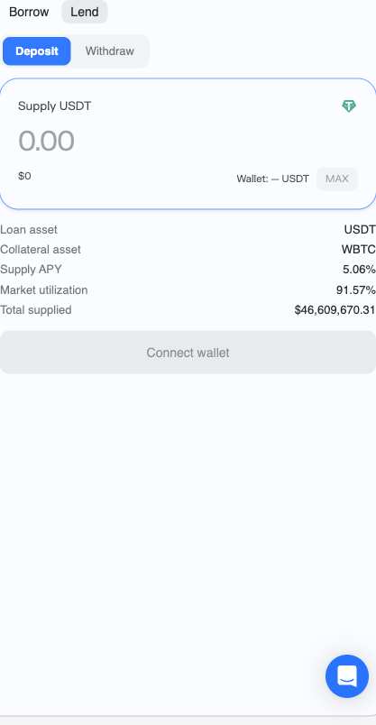
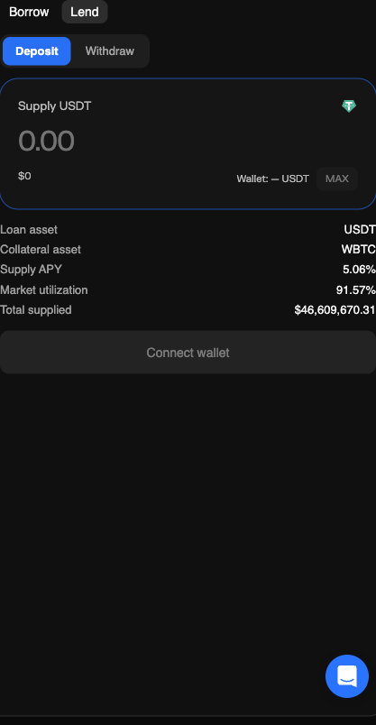
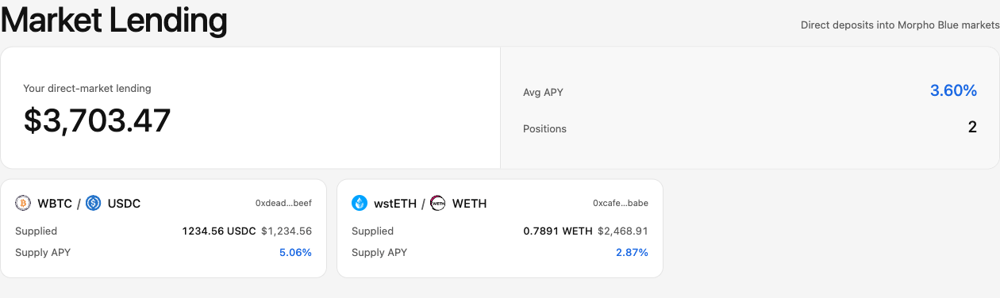
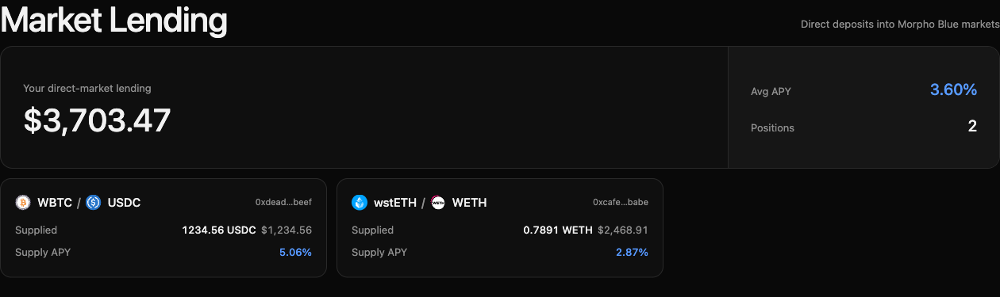
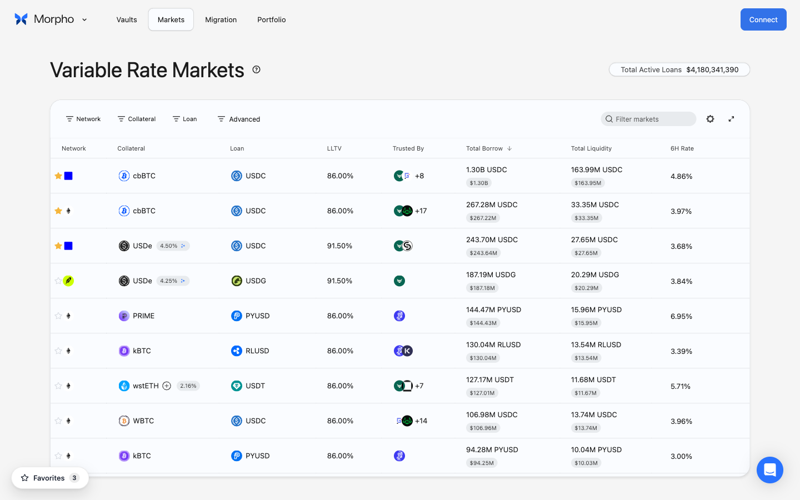
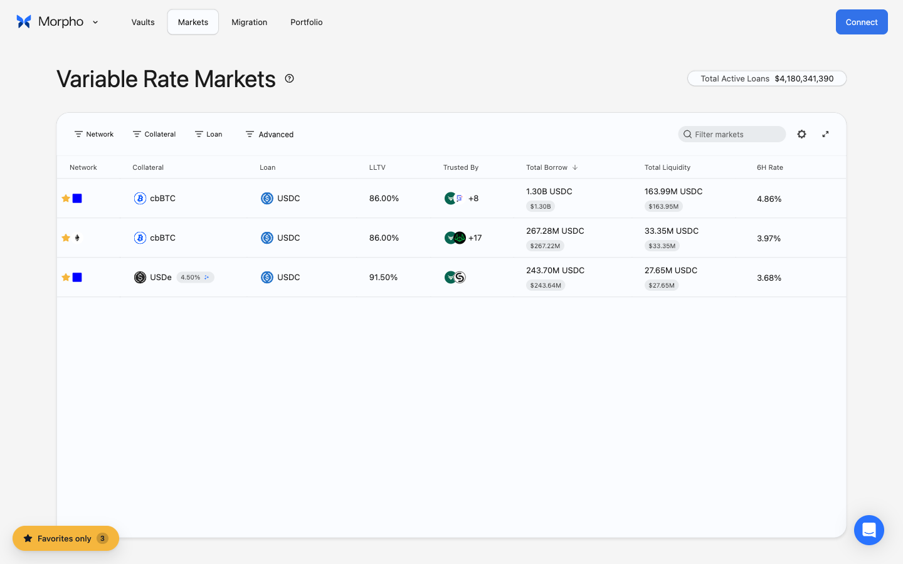

# Morpho Enhancements

[English](README.md) · **简体中文** · [日本語](README.ja.md) · [한국어](README.ko.md) · [Русский](README.ru.md) · [Español](README.es.md)

一款 Chrome 扩展,填补 [app.morpho.org](https://app.morpho.org) 的三个空缺:

1. **单个市场级别的 Supply / Withdraw** —— 在任何 Morpho Blue 的市场页,官方 UI 只提供 Borrow。本扩展在 Borrow 旁边注入一个 **Lend** 标签,可直接把贷款资产存入该市场(调用的是与 MetaMorpho vault 内部一致的 `Morpho.supply()`),之后也能在同一界面 Withdraw —— 让你不用经过 vault 就能赚取该市场专属的放贷利息。

2. **Dashboard 能看到直接放贷** —— 官方 dashboard 只显示 vault 存款和借贷头寸,不显示直接放贷。本扩展新增一张 **Market Lending** 卡片,列出用户在所有 Morpho 支持链上的直接放贷,包含 USD 价值、APY 和跳回市场页的快捷入口。

3. **`/markets` 和 `/vaults` 上的收藏功能** —— 点击行首的星号收藏任意市场或金库,底左角的 **Favorites only** 开关把列表筛成只剩你关心的那几条。收藏保存在浏览器本地,多标签页实时同步。

<p align="center">
  
  
</p>

<p align="center">
  
</p>

<p align="center">
  
</p>

<p align="center">
  
</p>

<p align="center">
  
</p>

> 所有截图都使用了模拟的持仓数据。真实余额、钱包地址和市场哈希永远不会出现在公开发布的图片里。

## 功能特性

- **Borrow | Lend 标签切换** —— 市场面板上新增 Lend 标签。点击后原生表单切换为 Supply / Withdraw UI,视觉风格匹配 Morpho 的亮色和暗色主题。
- **ETH / WETH 自动包装** —— 当市场贷款资产是该链的 wrapped-native 代币时,开关一打,直接用原生 ETH(或 Polygon 的 POL、Monad 的 MON、HyperEVM 的 HYPE)支付,扩展自动在 Supply 前 wrap、Withdraw 后 unwrap。全程两次签名,没有单独的 wrap UX 跳转。
- **多链 Dashboard** —— Market Lending 卡片一次请求就覆盖所有 Morpho 支持链。完整链列表维护在 [src/services/chain/morphoSupportedChains.ts](src/services/chain/morphoSupportedChains.ts)。
- **列表页收藏** —— 在 `/markets` 和 `/vaults` 给任意行打星标,再用一键 chip 把列表筛到只剩你关心的那些。数据只存 `localStorage`(无服务器、无追踪),离线可用,多标签页同步。
- **复用页面钱包** —— 不需要二次连接钱包。支持 MetaMask、Rabby、Frame、Coinbase Wallet,以及任何符合 EIP-6963 的注入钱包。
- **兼容非标准 ERC-20** —— USDT(以及其他 `approve` 不返回数据的代币)开箱即用;approve ABI 声明为 no outputs,这样 viem 的 simulation 不会在 `0x` 上报错。
- **错误消息人性化** —— 拒签静默回到 idle。余额不足、错链、nonce 卡住、revert 原因都会变成一句话,不是 2KB 的 viem 堆栈。
- **零分析、零遥测、零后端** —— 直接通过公共 RPC 调用 Morpho Blue 合约,另外用 Morpho 自家的 blue-api 拿 APY 和 USD 数据。

## 实现原理

- **合约** —— 所有读写都走 Morpho Blue 单例合约 `0xBBBBBbbBBb9cC5e90e3b3Af64bdAF62C37EEFFCb`(在每条支持链上通过 CREATE2 部署在同一地址)。`idToMarketParams(id)` 把 URL 里的 market id 解析为链上参数;`supply(params, assets, 0, onBehalf, "0x")` 处理存款;`position(id, user)` + `market(id)` 提供余额计算。
- **钱包桥** —— 一个 `world: "MAIN"` 的 content script 实现 EIP-6963 发现(含 `window.ethereum` 兼容回退),通过 `window.postMessage` 把 EIP-1193 请求代理到隔离世界的 content script。UI 在此之上构造一个 viem `WalletClient`,从不持有私钥。
- **数据源** —— 轻量 GraphQL 查询 `https://blue-api.morpho.org/graphql` 拿 APY 和 USD。Shares-to-assets 的换算也在本地 `sharesMath.ts` 移植了一份,用于直接链上读取。
- **UI** —— React 19 挂载在 Shadow DOM 里,扩展的样式不会泄漏到 Morpho 页面(反之亦然)。SPA 路由切换通过 patch `history.pushState` / `replaceState` 捕获,加上一个节流过的 `MutationObserver`,忽略动画导致的 DOM 抖动。

## 支持的链

| slug (URL) | chainId | 原生 / wrapped-native |
|---|---|---|
| `ethereum` | 1 | ETH / WETH |
| `base` | 8453 | ETH / WETH |
| `arbitrum` | 42161 | ETH / WETH |
| `opmainnet` | 10 | ETH / WETH |
| `polygon` | 137 | POL / WPOL |
| `unichain` | 130 | ETH / WETH |
| `monad` | 143 | MON / WMON |
| `world-chain` | 480 | ETH / WETH |
| `katana` | 747474 | ETH / WETH |
| `hyperevm` | 999 | HYPE / WHYPE |

Slug 来源于 `app.morpho.org/sitemap.xml`;合约地址来源于 [`morpho-blue-api-metadata`](https://github.com/morpho-org/morpho-blue-api-metadata)。

## 安装

### 从 GitHub Releases 安装(Chrome Web Store 审核未通过期间推荐)

每次打 `v*` tag 会触发 GitHub Actions 构建,并把 ZIP 附到 [Releases 页面](../../releases)。步骤:

1. 从最新 release 下载 `morpho-enhancements-<version>-unpacked.zip`
2. 解压到一个稳定的目录(比如 `~/extensions/morpho-enhancements/`)
3. 打开 `chrome://extensions`
4. 右上角打开 **开发者模式**
5. 点击 **加载已解压的扩展**,选择解压后的文件夹

Chrome 会提示"开发者模式扩展",这对任何本地安装的扩展都属正常。Chrome Web Store 审核通过后才能一键安装,但要等几天;功能上这条路径完全一致。

### 从源码安装(开发用)

```bash
pnpm install
pnpm build
# Chrome → chrome://extensions → 打开开发者模式 → 加载已解压的扩展 → 选 ./dist
```

开发时用 `pnpm dev`(Vite + crxjs HMR)。

## 测试

```bash
# DOM 探针,对真实站点运行,抓锚点和样例布局 JSON
pnpm probe

# End-to-end — 用构建好的扩展启动 Chromium,验证 Lend 标签、
# dashboard 挂载、暗色模式可读性、provider 桥
pnpm test:e2e
```

重新生成 README 截图(GraphQL 响应被 mock,不会泄漏真实余额):

```bash
pnpm exec playwright test tests/e2e/screenshots.spec.ts
```

## 项目结构

```
src/
├── manifest.config.ts        # MV3 manifest 声明
├── content/
│   ├── main.ts               # ISOLATED world — SPA 路由监听 + 挂载分发
│   ├── mount.ts              # Shadow DOM 容器 + React root + 主题同步
│   ├── router.ts             # pushState/replaceState → locationchange 事件
│   ├── marketIntegration.ts  # 市场面板上的 Borrow | Lend 标签注入
│   └── listsIntegration.ts   # /markets 和 /vaults 上的收藏星号 + filter chip
├── lib/
│   ├── morpho.ts             # viem public client + Morpho 合约封装
│   ├── morphoAbi.ts          # IMorpho + ERC20 + WETH9 ABI
│   ├── sharesMath.ts         # SharesMathLib 本地移植(virtual shares/assets)
│   ├── chains.ts             # Slug ↔ chain ID、wrapped-native、RPC 回退列表
│   ├── url.ts                # 路由匹配器(market / dashboard / list / other)
│   ├── favorites.ts          # 基于 localStorage 的收藏存储
│   ├── graphql.ts            # blue-api 客户端
│   └── pageProvider.ts       # 桥接客户端 + viem WalletClient 适配器
├── ui/
│   ├── MarketLendForm.tsx    # 市场页 Supply / Withdraw 表单(含 wrap 开关)
│   ├── DashboardSupplyCard.tsx
│   ├── errorMessage.ts       # viem 错误 → 简短用户友好消息
│   ├── format.ts             # bigint / USD / percent 格式化
│   └── styles.css            # Shadow-DOM 范围的主题 token
public/
├── icons/                    # scripts/make-logo.py 生成(16/32/48/128)
├── logo.svg                  # 主矢量图(Morpho 蝴蝶 + enhancement 徽章)
└── injected/
    └── provider-bridge.js    # 纯 JS 的 MAIN-world 桥接(不与 app 代码一起打包)
scripts/
├── make-logo.py              # 从 morpho-base.svg 生成扩展图标
└── morpho-base.svg           # 官方 Morpho 蝴蝶(源文件)
tests/
├── probe/                    # 针对 app.morpho.org 的 DOM 抓取
└── e2e/
    ├── extension.spec.ts     # 功能 E2E
    └── screenshots.spec.ts   # README / 商店 listing 截图(数据 mock 过)
```

## 安全

- 合约状态通过公共 RPC 读取(viem 每条链 4 个 provider 回退)。写入走用户钱包 —— 扩展永远不持有、也不请求私钥。
- 所有写调用在 `writeContract` 前都会先 `simulateContract`,让 revert 以可读错误的形式出现在钱包弹窗之前。
- 全额取回用 shares(不是 assets),避免利息累积时的精度 revert;部分取回用 assets,误差容忍 0.01%。
- Host permissions 限定在 `https://app.morpho.org/*`。除了用户自配的 RPC、`blue-api.morpho.org` 和 Morpho 的代币 logo CDN,扩展不向任何其他服务发送数据。

## 已知限制

- **一笔交易 wrap + supply** 暂未实现。Morpho 的 Bundler / GeneralAdapter 能把 wrap + approve + supply 合进一个 multicall;本扩展目前拆成 2–3 次签名,能跑,只是多点几下。
- **仅 WalletConnect 会话**(页面上没有注入 EIP-1193 provider 的情况)bridge 识别不到。
- **包体积** 压缩前约 530 KB,主要来自 viem。后续版本会动态 import viem 的链 / 合约代码路径。

## 发布

Chrome Web Store 提交流程(zip 结构、listing 文案、隐私披露、审核建议)见 [`docs/PUBLISHING.md`](docs/PUBLISHING.md)。

## 许可证

MIT —— 见 [LICENSE](LICENSE)。

本项目与 Morpho Labs 无关联。"Morpho" 和 Morpho 蝴蝶标志是各自所有者的商标;基础 logo 文件(`scripts/morpho-base.svg`)由 Morpho 的公共 CDN 提供。
